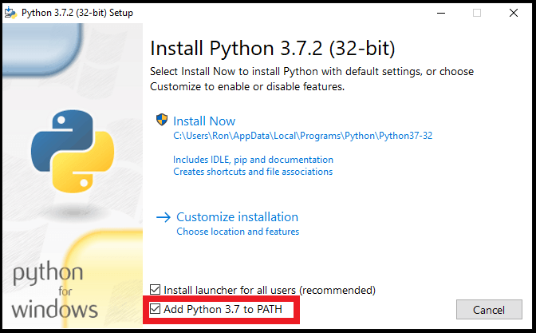

# PYTHON KURS
## Einstieg in die Kommandozeile
Wer programmieren lernen möchte, darf keine Angst vor der Kommandozeile (Terminal) haben. Unter Windows ist dies CMD und die neuere und viel mächtigere PowerShell. Unter MacOS und Linux z.B. die Bash-Konsole.
Wir nehmen die **PowerShell** unter Windows und probieren einige wesentliche Kommandos aus. 

### Programme starten
Auf der Kommandozeile können wir Programme starten, z.B.:

```cmd
notepad.exe
```

Es würde auch ohne die Angabe der Erweiterung ".exe" funktionieren. 

### TAB-Completion
Sehr praktisch ist auch die **TAB-Completion**, d.h. die Vervollständigung der Eingabe durch die Tab-Taste. Schreibe einmal nur

```cmd
note
```
und drücke danach die TAB-Taste (auch mehrmals). Du wirst Angebote zu Vervollständigung deiner Eingabe bekommen. 


### Verzeichnisse und Dateien
Zuhause befindest du dich auf der PowerShell bereits im `Dokumente`-Ordner. In der AG wechseln wir das Laufwerk:

```cmd
u:
```

und erstellen dort ein Verzeichnis (Ordner) für unsere AG:

```cmd
mkdir AG-Programmieren
```

und wechseln nun in diesen Ordner hinein mit `cd` (change directory):
```cmd
cd AG-Programmieren
```

Wir erstellen nun eine Datei, indem wir Notepad mit einem neuen Dateinamen aufrufen:
```cmd
notepad test.txt
```

Schreibe nun etwas in diese Datei, schließe sie und speichere sie.

>### Aufgaben
>Unten findest du weitere Kommandos. 
>1. Erstelle dann noch eine weitere Datei.
>1. Lasse dir den Inhalt der Dateien auf der Kommandozeile ausgeben.
>1. Benutze `start`, um die Datei im Standardprogramm für Textdateien zu öffnen (Notepad)
>1. Füge deiner Datei über die Kommandozeile einen Text hinzu.
>1. Lösche eine deiner Dateien.
>1. Lege ein Unterverzeichnus mit Dateien an und lösche das ganze Verzeichnis mit den Dateien.
>1. Probiere weitere Kommandos aus.


### *Mit ein paar Ausnahmen funktionieren diese Kommandos sowohl in der Bash als auch auf der PowerShell:*
|Kommandos|Funktion|
|---|---|
|mkdir                  |neues Verzeichnis (Ordner) erstellen|
|ls  /  dir  (Win CMD)  |Verzeichnisinhalt anzeigen|
|rm                     |Entfernt eine Datei (nur in der PowerShell, sonst `del`)
|rm – r                 |entfernt *rekursiv*, d.h. alle Dateien und Unterverzeichnisse eines Verzeichnisses
|pwd                    |Zeigt das aktuelle Verzeichnis an
|start  (Win)           |Öffnet eine Datei im Standardprogramm|
|cat                    |Gibt den Text einer Datei auf der Kommandozeile aus.
|echo                   |Gibt Text auf der Konsole aus oder schreibt ihn in eine Datei (`echo "Hallo Welt!" > test.txt`)
|hostname               |Den Namen des Rechners anzeigen
|ipconfig  (Win)        |Netzwerkkonfiguration des Recheners anzeigen


# Installation von Python und VSCode für zu Hause
Auf deinem Rechner zu Hause kannst du Python und VSCode (Visual Studio Code, der momentan bei weitem angesagteste aber auch für Anfänger geeignete Editor) installieren:
* https://www.python.org/
* https://code.visualstudio.com/

Wichtig ist bei der Python-Installation, dass du Python der PATH Variable hinzufügst, sodass python.exe auf der Kommandozeile verfügbar ist:



Beim Rest der Python-Installation sowie der VSCode-Installation kannst du die Standardeinstellungen übernehmen. Beim Arbeiten mit Python-Dateien in VSCode wird dir die Installation von der Python- und Pylance-Extension angebot, was du unbedingt machen solltest.

# Die Python Shell
Python-Code muss im Gegensatz zu Sprachen wie C/C++ nicht kompiliert werden. Er wird vom Interpreter bei der Ausführung in maschinenlesbaren Code umgewandelt. Wir können daher auch direkt auf der Python Shell unseren Code eingeben.

Öffne Visual Studio Code (VSCode) und wähle im Menu `Terminal` -> `New Terminal`.

Gib nun im Terminal ein:

```cmd
python.exe
```

Du landest auf der Python-Shell:

```cmd
>>>
```

Nun kann es losgehen. In jeder Programmiersprache ist das erste Programm das "Hello World!"-Programm. Das geht sehr einfach:

```python
>>>print("Hello World!")
Hello World
```

Einfache Rechnungen mit Python:
```python
>>>print(2 + 3)
5
```

*Auf der Shell könnte man die `print`-Anweisung auch weglassen. Später brauchen wir sie aber, wenn wir Code in Dateien speichern.*

---
>### Aufgabe
> In folgendem Online-Kurs lernst du mehr über die Python-Shell kennen:
>
> https://tutorial.djangogirls.org/de/python_introduction/
>
> Gehe den Kurs durch und probiere einiges aus. Du lernst etwas über Variablen, Listen und Dictionaries. Nach "Boolean" stopst du und es geht hier weiter.

# Python im Editor

Natürlich müssen wir unseren Code normalerweise in Dateien speichern. In Python sind dies `.py`-Dateien. In VSCode sollten wir immer einen Ordner mit den dazugehörigen Projektdateien öffnen. Daher legen wir erst ein neues Verzeichnis in unserem `AG-Programmieren`-Verzeichnis an, mit dem Namen `Einstieg` Danach öffnen wir es in VSCode (-> `Open Folder`).

Erstelle nun in VSCode eine neue Datei mit dem Namen "hello_world.py" mit folgendem Inhalt:

```python
print("Hello World!")
```

Führe die Datei aus, indem du auf den *grünen Pfeil* oben rechts klickst. Im Terminal im unteren Bereich siehst du den Output.

## Variablen
Das klappt? Super! Dann sind wir bereit. In der Einführung in die Python Shell bei Django Girls hast du schon Variablen kennen gelernt. Einer Variable weisen wir bestimmte Werte zu. In Python muss die Variable nicht vorher deklariert werden und der Typ nicht vorher festgelegt werden. Der Typ ergibt sich aus dem Inhalt, der zugewiesen wird. Dennoch ist es wichtig, ein paar  Typen zu kennen:

|Variablen-Typ|Beschreibung|Mögliche Werte|
|---|---|---|
|str|String = Zeichenkette in Anführungsstrichen|"Hallo Welt"|
|int|Integer = Ganze Zahl ohne Anführungsstriche|123|
|float|Gleitkommazahl (mit Punkt)|12.399|
|bool|Boolean = Wahrheitswert wahr oder falsch|True / False|

Lass uns das "Hello World!"-Programm umschreiben. Zunächst fragen wir den User (mit `input`), wie er/sie heißt, speichern dies in einer Variable und geben einen entsprechenden Gruß aus:

```python
name = input("Wie ist dein Name? ") 
print("Hallo " + name)
```
*Übrigens: Variablen werden immer klein geschrieben und mit einem Unterstrich (_), wenn sie aus mehreren Wörtern bestehen.*

Warum Typen wichtig sind, sieht man an folgendem Beispiel. Wir fragen das Alter ab und berechnen, wie alt die Person in 50 Jahren ist:

```python
alter = input("Wie alt bist du? ")
print("In 50 Jahren bist du " + alter + 50 + " Jahre alt.")
```

Die Fehlermeldung wird so aussehen.

```
Traceback (most recent call last):
  File "<stdin>", line 1, in <module>
TypeError: can only concatenate str (not "int") to str
```

>### Aufgabe
>Was ist passiert? Wie kann man es lösen?
>
>TIPP 1: 'concatenate' bedeutet verketten\
>TIPP 2: Typen können auch umgewandelt werden, z.B. mit `int(variablenname)`


## Der "Kurzgeschichten-Generator"
Wir wollen ein Programm erstellen, das eine Kurzgeschichte ausgibt. Das Programm sollte dem Benutzer zunächst
ein paar Fragen stellen und dann die Geschichte entsprechend anpassen. Die Ausgabe des Programms —
inklusive der Benutzereingaben - könnte wie folgt aussehen:

```
Dieses Programm schreibt eine Kurzgeschichte in der DU vorkommst.
Wie ist dein Name? Stefan
In welchem Monat ist dein Geburtstag? April
Deine Haarfarbe? blond
Dein Wohnort? Dortmund


Die Verabredung mit dem Komissar
Es war ein grauer Morgen im April. Die Sonne war gerade erst aufgegangen und
es war noch wenig Betrieb im Zentrum von Dortmund.
Hauptkommissar Hartmann stand vor dem Bistro und schaute auf die Uhr.
Wo bleibt Stefan nur?, dachte er. Ist etwas schief gelaufen?
Vielleicht hatte Stefans Freundin Wind von der Sache bekommen und seine
Pläne durchkreuzt.
Eine Person mit struwweligen blonden Haaren näherte sich mit raschen Schritten.
Der Kommissar atmete auf. Es war Stefan. Jetzt konnte eigentlich nichts
mehr passieren...
```
>### Aufgabe
>Schreibe das passende Programm dazu im Editor VSCode. Lege dazu eine neue Datei `kurzgeschichtengenerator.py` an. Speichere die Benutzereingaben in die Variablen `name`, `monat`, `haarfarbe` und `ort` und verwende sie dann im Text. Wie musst du Besonderheiten wie "Stefan`s`" und "blond`en`" lösen?
>
> TIPP: Du musst entweder jede Zeile des Textes in Anführungszeichen setzen und mit einem Pluszeichen am Ende mit der nächsten verknüpfen oder die sogenannte Docstring Formatierung mit je drei Anführungszeichen nutzen: `""" Mein mehrzeiliger Text """`

## Kontrollstrukturen, Listen und Dictionaries
Kontrollstrukturen legen die Reihenfolge fest, mit der Anweisungen ausgeführt werden. Die einfachste Form hast du oben bereits kennen gelernt: Die Sequenz, bei der einfach alle Befehle nacheinander abgearbeitet werden. Die wichtigsten Kontrollstrukturen sind:

|Kontrollstruktur|Code|Bedeutung|
|---|---|---|
|Verzweigungen|`if`|Wenn eine Bedingung erfüllt ist mache ...|
||`if` ... `else`|Wenn eine Bedingung erfüllt ist mache ..., sonst: mache ...|
|Schleifen|`while`|Solange eine Bedingung erfüllt ist mache fortlaufend ...,|
||`for`|Für jedes Element in einer Liste mache ...|
|Funktionen|`def myfunction():` <br> `    ...`|Code in einer Funktion ausführen| 

Bei Django Girls hast du noch zwei weitere wichtige Datentypen kennen gelernt, mit denen man mehrere Objekte strukturiert zusammenfassen kann: Listen und Dictionaries (Wörterbücher).

|Datentyp|Codebeispiel|Bezug auf Elemente|Erklärung|
|---|---|---|---|
|Listen|<pre>colors = ["blue", "red",]</pre> oder: <pre>colors = [<br>    "blue",<br>    "red",<br>    "orange",<br>]</pre>|`print(colors[0])` gibt den String "blau" aus.|Einfache Listenelemente in eckigen Klammern. Die Zählung beginnt mit 0. Beachte die Einrückung im mehrzeiligen Beispiel.|
|Dictionaries|<pre>favcolors = {<br>    "John": "blue",`<br>    "Kate": "green",<br>    "Peter": "red"<br>}</pre>|`print(favcolor["Kate"])` gibt Kates Lieblingsfarbe aus.|Die Elemente eines Dictionaries bestehen immer aus Schlüssel ("Kate") und Wert ("green") (-> key and value)|

### Pizzabestellung
Im folgenden kleinen Programm wollen wir eine Pizzabestellung abwickeln. Es soll noch ein Getränk ausgewählt werden können und zuletzt der korrekte Betrag angezeigt werden.

Für dieses Programm werden wir mit Variablen arbeiten. Des Weiteren kommen Listen und Dictionaries zum Einsatz. Außerdem brauchen wir for-Schleifen, um die Listen abzuarbeiten.

## Pizzabestellung mit Liste
Fangen wir einfach an: Erstelle eine neue Datei `pizzabestellung.py` im Verzeichnis 'AG-Programmieren'. Wir brauchen nun ein Menü und wollen es anzeigen. Dafür nehmen wir zunächst eine Liste und geben die Liste dann aus:

```python
pizzen = [
    "1 Pizza Margherita",
    "2 Pizza Funghi",
    "3 Pizza Salami",
    "4 Pizza Caprese",
    "5 Pizza Quattro Stagioni",
]

print(pizzen)
```

Das sieht nicht ganz so aus, wie wir das haben wollen. Das liegt daran: Bei einer Liste müssen wir jedes Element in einer for-Schleife durchlaufen und ausgeben. Man spricht hier von Iteration, man iteriert über die Liste. Wir wandeln den print-Befehl ab:

```python
for pizza in pizzen:
  print(pizza)
```

Dabei kann das Wort "pizza" nach `for` frei gewählt werden, der Variablenname "pizzen" aber natürlich nicht. Die Konvention ist aber, hier immer die Einzahl des Variablennamens zu nehmen.

>### Aufgaben I
>* Füge eine Überschrift "Unsere Speisekarte hinzu". <br>
>* Frage den Nutzer mit dem `input`-Befehl nach seiner Wunschpizza und speichere die Nummer in eine Variable.
>* Gib am Ende die gewählte Pizza aus, z.B. "Sie haben ... gewählt." (Siehe oben: Bezug auf Listenelemente) 
>
> ACHTUNG: Die Zählung beginnt bei 0, aber der Kunde gibt 1 ein. Was musst du beachten?
> 
> ACHTUNG: Der Kunde gibt die Zahl als String ein. Du musst den Typ noch in eine Zahl umwandeln `int(deinevariable)`

<details><summary>Lösung</summary>

```python
pizzen = [
    "1 Pizza Margherita",
    "2 Pizza Funghi",
    "3 Pizza Salami",
    "4 Pizza Caprese",
    "5 Pizza Quattro Stagioni",
]

print("Unsere Speisekarte:")

for pizza in pizzen:
    print(pizza)

auswahl = input("Bitte wählen Sie die Nummer Ihrer Pizza: ")

print("Sie haben " + pizzen[int(auswahl) - 1] + " gewählt.")
```

</details>
<br>

Nun wollen wir den Benutzer fragen, ob er auch etwas trinken möchte. Er wird uns mit "j" oder "n" antworten und wir müssen mit einem Vergleichsoperator feststellen, ob wir nun ein Getränk anbieten oder nicht. 

**Vergleichsoperatoren**
|Operator|Bedeutung|
|---|---|
|==|ist gleich|
|!=|ungleich|
|>|größer als|
|<|kleiner als|
|>=|größer/gleich|
|<=|kleiner/gleich|

In unserem Fall würden wir also wieder eine Variable mit dem durch den Benutzer eingegebenen Buchstaben füllen, den wir mit `input` abfragen:

```python
mit_drink = input("Möchten Sie auch etwas trinken? (j/n) ")
```

Nun bauen wir eine Verzweigung ein. 

```python
if mit_drink == "j":
    print("Unsere Getänkekarte: ")
    ...
else:
  ...
```

Wenn nicht "j" gedrückt wird, wird der else-Block ausgeführt.

>### Aufgaben II
> 1. Überlege dir, was beim else-Block ausgegeben werden soll.
> 1. Im if-Block muss unterhalb von "Unsere Getränkekarte" noch einmal eine Auswahl erfolgen. Du brauchst also oben noch eine Getränkeliste und musst im if-Block den Code ähnlich wie bei der Pizzaauswahl ergänzen.
> 1. "n" wird momentan nicht abgefragt. Hast du eine Idee wie du den Code verbessern kannst? Der else-Block soll nun für alle falschen Zeichen zuständig sein und eine entsprechende Rückmeldung geben. Für "n" kannst du einen weiteren if-Block einfügen. Du musst dabei aber nun `elif` verwenden, denn die Bedingung soll nur geprüft werden, wenn die erste Bedingung nicht zutraf.
> 1. Wenn nach einer falschen Eingabe erneut nach dem Getränk gefragt werden soll, muss man anders vorgehen. Es gibt verschiedene Möglichkeiten:
>
>    a) Der Code kann zum Beispiel in eine Funktion verlagert werden (`def select_drink():`) und im Falle einer falschen Eingabe ruft sich die Funktion selbst wieder auf.
>
>    b) Der Code kann in einer While-Schleife ausgeführt. Die While-Schleife wird solange ausgeführt, wie eine definierte Bedigung wahr ist. Am Einfachsten definieren wir eine Getränkeabfrage als Endlosschleife `while True:`, aus der wir nur am Ende des `if`- und `elif`-Blocks ausbrechen, wenn also die Eingabe "n" oder "j" ist. Dazu fügen wir im Ende der Blöcke `break` hinzu.

## Pizzabestellung mit dictionary und GUI
Wir heben die Pizzabestellung auf das nächste Level. Statt eines konsolenbasierten Programms wollen wir nun ein Programm mit GUI (Graphical User Interface) um mit dem Nutzer zu interagieren. In Python integriert ist grafische Toolkit tkinter.

Zunächst importieren wir zu Beginn tkinter und machen es durch den verkürzten Namen `tk` erreichbar:

```python
import tkinter as tk
```

Wir erstellen das Fenster mit der Variablen `window` mit folgendem Code. Um die Erstellung der grafischen Oberfläche auszuführen, muss am Ende `window.mainloop()` stehen

```python
# Initialisierung des Fensters
window = tk.Tk()
window.geometry("300x200")
window.title("Pizzabestellung")

window.mainloop()
```

Probiere es aus. Du solltest ein leeres tkinter-Fenster mit dem Titel "Pizzabestellung" sehen. 

Nun wollen wir eine Frame erstellen, den wir danach auch wieder entfernen können um neue Inhalte anzuzeigen. Außerdem wollen wir nun Text anzeigen mithilfe eines Labels und einen Button erzeugen, der später die Funktion `show_pizza_menu()` ausführt. Die Elemente werden danach jeweils mit dem Befehl `pack()` auf der Benutzeroberfläche angeordnet.

```python
frame = tk.Frame(window)
frame.pack()

label = tk.Label(frame, text="Willkommen zur Pizzabestellung")
label.pack()

button = tk.Button(frame, text="Weiter", command=show_pizza_menu)
button.pack()
```

Damit der Code jetzt schon ausführbar ist, muss die Funktion `show_pizza_menu()` zumindest mit einem Plazhalter (`pass`) schon einmal eingerichtet werden. Füge unterhalb des Imports von tkinter folgendes ein:

```python
import tkinter as tk

# Funktionen für die Benutzeroberfläche
def show_pizza_menu():
    pass
```

Der Weiter-Button wird noch nichts bewirken. Probiere aus, was passiert, wenn du `pass` durch `print("TEST")` austauschst.


### Pizza- und Getränkemenü als Dictionaries in einem Dictionary

Unsere Menü-Listen aus dem vorherigen Beispiel ersetzen wir nun durch Dictionaries. Genauer: Ein Dictionary, das wiederum dictionaries enthält. Der Schlüssel 1 enthält im Folgenden ein weiteres Dictionary als Wert. Diese enthält nun die Schlüssel "name" und "preis" mit den ensprechenden Werten. So ist es einfacher, sich auf die einzelnen Elemente zu beziehen. Wir fügen folgende Dictionaries nach dem Import-Befehl in unseren Code ein:

```python
# Pizza- und Getränkeauswahl mit dictionaries in einem dictionary
pizzen = {
    1: {"name": "Pizza Margherita", "preis": 5},
    2: {"name": "Pizza Funghi", "preis": 6},
    3: {"name": "Pizza Salami", "preis": 7},
    4: {"name": "Pizza Caprese", "preis": 7},
    5: {"name": "Pizza Quattro Stagioni", "preis": 8},
}

drinks = {
    1: {"name": "Wasser", "preis": 1},
    2: {"name": "Fanta", "preis": 2},
    3: {"name": "Sprite", "preis": 2},
    4: {"name": "Cola", "preis": 3},
    5: {"name": "Kaffee", "preis": 4},
}
```

### Funktion zur Darstellung des Menüs
Die Funktion `show_pizza_menu()` müssen wir nun mit Inhalt füllen. Zunächst löschen wir den alten Frame und erstellen einen neuen Frame. Ein Label enthält wieder die Überschrift. Achte wieder darauf, dass Integer in Strings umgewandelt werden müssen, wenn wir sie in einem String verkettenwollen. 

Dann erstellen wir mittels einer For-Schleife, die über das Dictionary iteriert, das Pizzamenü. Mit dem `pack`-Befehl werden die Elemente wieder auf dem Frame angeordnet.

